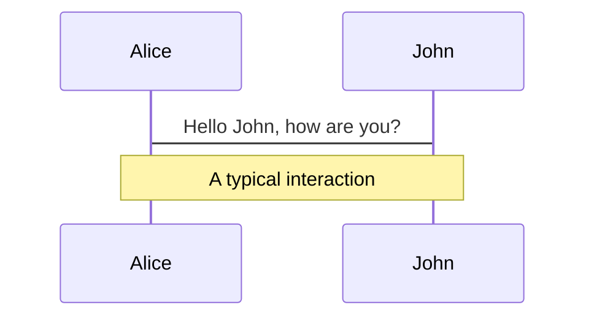
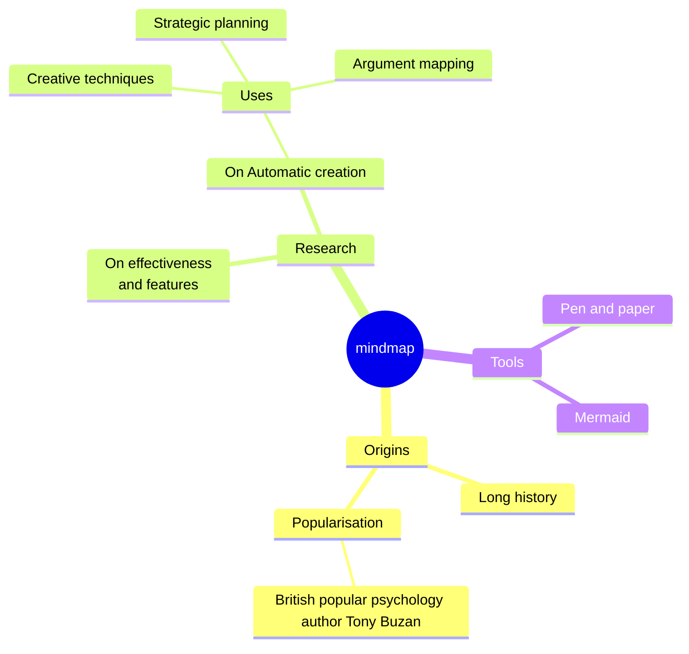

<style>
.footnotes-sep {
  @apply mt-5 opacity-10;
}
.footnotes {
  @apply text-sm opacity-75;
}
.footnote-backref {
  display: none;
}
</style>

# Wireless Networking

“Wireless communication is the future” – Robert E. Kahn

<div class="pt-12">
  <span @click="$slidev.nav.next" class="px-2 py-1 rounded cursor-pointer" hover="bg-white bg-opacity-10">
    Press Space for next page <carbon:arrow-right class="inline"/>
  </span>
</div>

<div class="abs-br m-6 flex gap-2">
  <a href="https://github.com/aarmn/uni-works" target="_blank" alt="GitHub" title="Open in GitHub of my note-worthy random works"
    class="text-xl slidev-icon-btn opacity-50 !border-none !hover:text-white">
    <carbon-logo-github />
  </a>
</div>

<!--          
The background image illustrates a single unit within the vast array of thousands of Starlink satellites orbiting the sky providing a new global gateway to networking.
-->

---
transition: fade-out
---

# Wireless Networking Technologies

Exploring the diverse world of wireless networking technologies, each operating (often) on unique frequencies of the electromagnetic spectrum.

- 📶 **Wifi (Wireless Fidelity)** - Enables devices to connect to the internet or each other wirelessly, eliminating the need for physical cables.
- 💡 **Lifi (Light Fidelity)** - Similar to Wifi, but employs VLC (visible light communication) for data transmission.
- 🐝 **Zigbee** - A high-level communication protocol utilized in low-power digital radios for applications requiring low data rates, such as IoT devices.
- 🛰️ **Satellite** - Facilitates internet communication through the transmission of signals to and from satellites, representing a rapidly evolving technology sector.
- 📱 **Cellular (3G, 4G, 5G, 6G)** - The technology behind mobile phone connectivity to the internet.

<!--
Here is another comment.
-->

---
transition: slide-up
class: text-center text-4xl
layout: center
background: ./background.jpg
---

# Wi-Fi

<style>
h1 {
  font-size: 3em;
}
</style>

---
transition: slide-up
layout: two-cols
---

# What is Wi-Fi

Wi-Fi, short for Wireless Fidelity, operates on unique frequencies of the electromagnetic spectrum. Wi-Fi has become ubiquitous in modern society.

Pros:
- Enables mobility and flexibility in device usage
- Widely available in public spaces and private residences
- High Bandwidth

Cons:
- Susceptible to interference and signal degradation
- Security vulnerabilities if not properly configured
- Potential health concerns related to prolonged exposure to Wi-Fi signals

::right::

<div v-click style="max-width: 200px; filter: invert(100%) sepia(100%) saturate(0%) hue-rotate(0deg) brightness(100%) contrast(100%); margin: 0 auto;">
  
</div>


::div{v-click="true"}
<h2> Scope </h2>

**PAN or LAN**
::

<div v-click>
<h3>Table of Contents:</h3>
</div>
<Toc v-after minDepth="2" maxDepth="2"></Toc>

---
transition: slide-up
level: 2
---

# Timeline

- 1971: ALOHAnet becomes the first wireless packet data network.
- 1985: The FCC allocates bands of the radio spectrum for unlicensed use.
- 1997: The IEEE creates the first 802.11 standard.
- 1999: The introduction of 802.11b, Wi-Fi gains popularity.
- 2003: WPA introduced as a security response to WEP's weaknesses.
- 2009: The IEEE standardizes 802.11n, introducing multiple-input multiple-output (MIMO).
- 2013: The introduction of 802.11ac, focusing on higher throughput.
- 2018: WPA3 is introduced, enhancing Wi-Fi security further.
- 2019: Wi-Fi 6 (802.11ax) is introduced, focusing on efficiency.
- 2021: Wi-Fi 6E, extending Wi-Fi 6 capabilities into the 6 GHz band, reducing congestion and improving speeds.
- 2022: Wi-Fi 7 (802.11be) development begins, promising even higher throughput and efficiency, targeting support for extremely high-density scenarios.


<!--

- 1971: ALOHAnet, a pioneering project developed at the University of Hawaii, enabled wireless communication across the Hawaiian Islands using UHF frequencies. This groundbreaking network laid the foundational principles for modern Wi-Fi technology, demonstrating the feasibility of large-scale, wireless packet data networks.
- 1985: A landmark decision by the FCC to permit the unlicensed use of the ISM bands (Industrial, Scientific, and Medical) catalyzed the development of Wi-Fi. This regulatory change allowed devices to communicate wirelessly without the need for individual FCC licenses, removing a significant barrier to innovation and adoption.
- 1997: The IEEE's establishment of the 802.11 standard represented the formal inception of Wi-Fi technology. This standard provided for wireless communication speeds up to 2 Mbps, a significant advancement that set the stage for future developments in wireless networking.
- 1999: The release of 802.11b marked a turning point for Wi-Fi, making it more accessible to the general public. With speeds up to 11 Mbps, this standard facilitated the widespread adoption of Wi-Fi in residential and commercial settings, heralding a new era of connectivity.
- 2003: The introduction of Wi-Fi Protected Access (WPA) marked a significant advancement in wireless security, addressing numerous vulnerabilities present in the Wired Equivalent Privacy (WEP) protocol. WPA's enhanced security features helped to build user trust in wireless networks.
- 2009: The IEEE's standardization of 802.11n was a major technological leap forward, incorporating MIMO (Multiple Input, Multiple Output) technology. This innovation significantly boosted Wi-Fi speeds and reliability by utilizing multiple antennas for data transmission and reception, enhancing the user experience.
- 2013: The 802.11ac standard brought about a focus on increased throughput, achieving speeds up to several Gbps in the 5 GHz band. This standard represented a substantial improvement over its predecessors in terms of speed and range, meeting the growing demand for high-bandwidth wireless communication.
- 2018: The introduction of WPA3 addressed the security shortcomings of WPA2, offering more robust protections against offline dictionary attacks and ensuring forward secrecy. This enhancement was a critical step in evolving Wi-Fi security to meet contemporary challenges.
- 2019: Wi-Fi 6 (802.11ax) was introduced, emphasizing improvements in efficiency and the support for a higher density of devices. This standard was designed to address the challenges of our increasingly connected world, optimizing bandwidth usage and reducing interference.
- 2021: Wi-Fi 6E extended the capabilities of Wi-Fi 6 into the 6 GHz band, aiming to alleviate congestion and enhance speeds by tapping into a broader spectrum. This development was a significant stride towards accommodating the exponential growth in Wi-Fi-enabled devices.
- 2022: The initiation of Wi-Fi 7 (802.11be) development, with its focus on achieving even higher throughput and efficiency, promises to revolutionize wireless communication technology. This forthcoming standard is being tailored to support extremely high-density scenarios, paving the way for the next generation of wireless connectivity.

These milestones highlight the rapid evolution of Wi-Fi technology, from its early beginnings to its current status as a critical component of modern wireless communication.
-->

---
transition: slide-up
level: 2
---

# Security

- Why?
- WEP (Wired Equivalent Privacy)
- WPA (Wi-Fi Protected Access)
- WPA2
- WPA3

<!-- 
Why wireless communications secuirty matter? wire is a limit, it forces you to people who can connect to it in a radius, wireless communication lifts this limit, and with this limit lifted problems would arise, as nov this ease means ease of anyone in the range also connecting wireless network. this is concerning.

Initially, WEP aka Wired Equivalent Privacy, which was not even close to its claim, was introduced as de-facto and de-jury standard for Wifi Networks security, it used 64bit and 128bit keys (?which tech, why vulnerable?) had some serious issues, 

WPA or Wi-Fi Protected Access, was introduced as an intermediate measure while waiting for the full IEEE 802.11i standard. It totally replaced WEP and implemented the Temporal Key Integrity Protocol (TKIP).

After that WPA tried to be even better building up on WPA success, plus, adhereing to the IEEE 802.11i standard and uses the AES (Advanced Encryption Standard which uses Rijndael algorithm) for encryption

WPA3, Introduced in 2018, addressed an array of security improvements overr WPA2, for example, Individualized Data Encryption: Each device has its own encryption key.
Protection Against Brute-Force Attacks: WPA3 makes it harder for attackers to guess passwords.
Enhanced Security for Open Networks: Even open (unencrypted) networks benefit from WPA3’s protections

If you wanna setup a wireless network today, ensure WPA2 or 3 is used, or else the chance of your networking being easily compermised is high, and always use complicated passwords, as an easy to guess password is always a bad idea, no matter how secure the backbone technology be. 
-->

---
transition: slide-up
level: 2
---

# Govermental Body

- **IEEE** (Institute of Electrical and Electronics Engineers)
  - Sets Wi-Fi standards.
- **Wi-Fi Alliance**
  - Ensures product compatibility.
- **Bandwidth and Frequency Assignment Bodies**
  - **ITU** (International Telecommunication Union)
    - Manages global radio spectrum.
  - **FCC** (Federal Communications Commission)
    - Regulates US communications.
  - **ETSI** (European Telecommunications Standards Institute)
    - Develops ICT standards in EU.

<!--
- **IEEE (Institute of Electrical and Electronics Engineers)**
  - Develops and maintains networking standards, including the 802.11 Wi-Fi standards.
- **Wi-Fi Alliance**
  - A global network of companies that drives the interoperability, adoption, and evolution of Wi-Fi technology.
  - Promotes Wi-Fi technology and certifies Wi-Fi products to ensure they meet standards for security and interoperability.
  - **Companies in the Wi-Fi Alliance**
    - **Apple Inc.**
    - **Cisco Systems, Inc.**
      - A global leader in IT, networking, and cybersecurity solutions.
    - **Intel Corporation**
    - **Microsoft Corporation**
    - **Qualcomm Incorporated**
- **Bandwidth**
  - **ITU (International Telecommunication Union)**
    - A United Nations specialized agency for information and communication technologies.
    - Allocates global radio spectrum and satellite orbits, develops the technical standards that ensure networks and technologies seamlessly interconnect.
  - **FCC (Federal Communications Commission)**
    - Regulates interstate and international communications by radio, television, wire, satellite, and cable in the USA.
    - Responsible for managing and licensing the electromagnetic spectrum for commercial users and for non-commercial users including state, county, and local governments.
  - **ETSI (European Telecommunications Standards Institute)**
    - Produces globally applicable standards for Information and Communications Technologies (ICT), including fixed, mobile, radio, converged, broadcast, and internet technologies.
-->

---
transition: slide-up
level: 2
---

# Standards

| Standard Name        | Cap Speed (Max Data Rate) | Allocated Frequency Range |
|----------------------|---------------------------|---------------------------|
| 802.11b              | 11 Mbps                   | 2.4 GHz                   |
| 802.11a              | 54 Mbps                   | 5 GHz                     |
| 802.11g              | 54 Mbps                   | 2.4 GHz                   |
| 802.11n              | 600 Mbps                  | 2.4 GHz / 5 GHz           |
| 802.11ac             | 6.9 Gbps                  | 5 GHz                     |
| 802.11ax (Wi-Fi 6)   | 9.6 Gbps                  | 2.4 GHz / 5 GHz           |
| 802.11ax (Wi-Fi 6E)  | 9.6 Gbps                  | 6 GHz                     |
| 802.11be (Wi-Fi 7)   | 40+ Gbps                  | 6 GHz - 7.125 GHz         |

<!--
Here is another comment.
level: 2
-->

---
transition: slide-up
class: text-center text-4xl
layout: center
---

# ZigBee

<style>
h1 {
  font-size: 3em;
}
</style>

---
transition: slide-up
layout: two-cols
--- 

# Zigbee Outline

Zigbee is a reliable alternative to Wi-Fi based on IEEE 802.15.4-based specification for low-power consumption use-cases, e.g: in IoT, but being less power hungry is not the only thing it brings on table

Pros:
 - mesh network structure
 - no licencing fee
 - one of the biggest collections
 - star (alike) network topology
 - routers and hubs
 - low latency

Cons:
 - fragmented compatibility
 - low bandwidth

::right::

::div{v-click="true"}
<h2> Scope </h2>

**PAN or LAN**
::

<div v-click style="filter: invert(100%) sepia(100%) saturate(0%) hue-rotate(0deg) brightness(100%) contrast(100%); margin: 0 auto;">
  
</div>

<div v-click class="h-8"></div>

<div v-after>
<h3>Table of Contents:</h3>
</div>
<Toc v-after minDepth="2" maxDepth="2"></Toc>

<!--
super long live time
extra: single co-ordinator, no auto reconection
bad range compared to competitors
-->

---
transition: slide-up
layout: two-cols
level: 2
---

# Where it's used?

## Fields
- IoT (Internet of Things)
- Home Automation
- Industrial Automation
- Medical Devices

## Actual Devices
- Amazon Echo Plus and Echo Show
- Philips Hue
- Samsung SmartThings
- Belkin WeMo
- Hive Active Heating and accessories
- Yale smart locks
- Honeywell thermostats

::right::

::div{v-click="true"}

::

---
transition: slide-up
level: 2
---

# Timeline

The History of Zigbee: A Low-Power, Low-Cost Wireless Communication Standard

- Early Beginnings (1998-2002)
- Zigbee 1.0 (2002)
- Zigbee 2004 (2004)
- Zigbee 2006 (2006)
- Zigbee 2007 (2007)
- Zigbee 3.0 (2016)
- Zigbee 3.1 (2020)

<!-- 

Zigbee is a low-power, low-cost wireless communication standard that has been widely used in various applications, including home automation, industrial control, and Internet of Things (IoT) devices. The history of Zigbee dates back to the late 1990s, and it has undergone significant developments and updates over the years.

**Early Beginnings (1998-2002)**

The concept of Zigbee was first introduced in 1998 by a group of companies, including Intel, Motorola, and Philips, who formed the Zigbee Alliance. The initial goal was to create a low-power, low-cost wireless communication standard that could be used for home automation and other applications. The first Zigbee specification was released in 2002, which defined the basic architecture and protocol stack for the technology.

**Zigbee 1.0 (2002)**

The first version of Zigbee, known as Zigbee 1.0, was released in 2002. This version supported a data rate of 20 kbps and had a range of around 10-100 meters. Zigbee 1.0 was primarily designed for home automation applications, such as controlling lighting, temperature, and security systems.

**Zigbee 2004 (2004)**

In 2004, the Zigbee Alliance released an updated version of the standard, known as Zigbee 2004. This version introduced several improvements, including increased data rates (up to 40 kbps), improved security features, and support for more devices on a single network.

**Zigbee 2006 (2006)**

The next major update to the standard was released in 2006, known as Zigbee 2006. This version introduced several new features, including support for mesh networking, which allowed devices to communicate with each other directly, and improved power management capabilities.

**Zigbee 2007 (2007)**

In 2007, the Zigbee Alliance released another update, known as Zigbee 2007. This version introduced support for additional frequency bands, including the 868 MHz and 915 MHz bands, which are commonly used in Europe and North America, respectively.

**Zigbee 3.0 (2016)**

The most significant update to the standard was released in 2016, known as Zigbee 3.0. This version introduced several major improvements, including:

* Increased data rates (up to 250 kbps)
* Improved security features, including AES-128 encryption
* Support for IPv6, which allows for more devices to be connected to the internet
* Improved power management capabilities, which enable devices to run for years on a single battery

**Zigbee 3.1 (2020)**

The latest version of the standard, known as Zigbee 3.1, was released in 2020. This version introduces several new features, including:

* Improved security features, including mandatory implementation of secure boot and secure firmware updates
* Support for new use cases, such as smart energy management and industrial automation
* Improved performance and reliability, including better support for mesh networking and device Commissioning

**Key Features of Zigbee**

Zigbee is a low-power, low-cost wireless communication standard that offers several key features, including:

* Low power consumption, which enables devices to run for years on a single battery
* Low cost, which makes it an attractive option for many applications
* High reliability, which ensures that devices can communicate with each other consistently
* Mesh networking capabilities, which allow devices to communicate with each other directly
* Support for multiple frequency bands, including 2.4 GHz, 868 MHz, and 915 MHz

**Applications of Zigbee**

Zigbee is widely used in various applications, including:

* Home automation, such as controlling lighting, temperature, and security systems
* Industrial automation, such as monitoring and controlling industrial equipment
* IoT devices, such as smart sensors and actuators
* Smart energy management, such as monitoring and controlling energy usage
* Wearable devices, such as fitness trackers and smart watches

In conclusion, Zigbee has come a long way since its inception in the late 1990s. From its early beginnings as a low-power, low-cost wireless communication standard to its current status as a widely used technology in various applications, Zigbee has undergone significant developments and updates over the years. Its latest version, Zigbee 3.1, offers several new features and improvements, making it an attractive option for many applications.

-->

---
transition: slide-up
level: 2
layout: two-cols
---

# Govermental Body

Here are the governing bodies, organizations, and regulatory agencies involved with Zigbee, along with their roles and responsibilities:

<!--
**Governing Bodies:**

1. **Zigbee Alliance**: The Zigbee Alliance is a non-profit organization that oversees the development and promotion of Zigbee technology. The alliance is responsible for maintaining the Zigbee standard, ensuring interoperability between devices, and certifying products that meet the Zigbee specification.
2. **IEEE (Institute of Electrical and Electronics Engineers)**: IEEE is a professional organization that develops and publishes standards for a wide range of technologies, including wireless communication protocols like Zigbee. The IEEE 802.15.4 standard serves as the foundation for Zigbee.

**Regulatory Agencies:**

1. **FCC (Federal Communications Commission)**: In the United States, the FCC regulates the use of wireless communication devices, including those using Zigbee technology. The FCC sets rules and guidelines for device manufacturers, ensuring that devices operate within designated frequency bands and power levels.
2. **ETSI (European Telecommunications Standards Institute)**: In Europe, ETSI is responsible for developing and promoting telecommunications standards, including those related to wireless communication protocols like Zigbee.
3. **IC (Innovation, Science and Economic Development Canada)**: In Canada, IC regulates the use of wireless communication devices, including those using Zigbee technology.

**Bandwidth and Frequency Allocation:**

Zigbee operates in the 2.4 GHz frequency band, which is a globally available, unlicensed spectrum. The specific frequency allocation for Zigbee devices varies by region:

* In the United States, Zigbee devices operate in the 2.4 GHz band, with a bandwidth of 2 MHz per channel.
* In Europe, Zigbee devices operate in the 2.4 GHz band, with a bandwidth of 1 MHz per channel.
* In Japan, Zigbee devices operate in the 2.4 GHz band, with a bandwidth of 1 MHz per channel.

The Zigbee Alliance and regulatory agencies work together to ensure that Zigbee devices comply with regional regulations and do not interfere with other wireless communication systems operating in the same frequency band.

**Other Organizations Involved:**

1. ** Thread Group**: The Thread Group is a non-profit organization that promotes the adoption of Thread, a low-power wireless mesh networking protocol that is compatible with Zigbee.
2. **Home Grid Forum**: The Home Grid Forum is a non-profit organization that promotes the adoption of G.hn, a home networking technology that can be used in conjunction with Zigbee.
3. **Z-Wave Alliance**: The Z-Wave Alliance is a non-profit organization that promotes the adoption of Z-Wave, a wireless communication protocol that competes with Zigbee in the home automation market.

These organizations work together to advance the development and adoption of Zigbee technology, ensuring that devices from different manufacturers can interoperate seamlessly and providing a robust ecosystem for IoT applications.
-->

**Governing Bodies:**

1. **Zigbee Alliance**
2. **IEEE (Institute of Electrical and Electronics Engineers)**

**Regulatory Agencies:**

1. **FCC** (Federal Communications Commission)
2. **ETSI** (European Telecommunications Standards Institute)
3. **IC** (Innovation, Science and Economic Development Canada)
4. **ITU** (International Telecommunication Union)

::right::

**Bandwidth and Frequency Allocation:**

Zigbee operates in the 2.4 GHz frequency band, which is a globally available, unlicensed spectrum. The specific frequency allocation for Zigbee devices varies by region:

* In the United States, Zigbee devices operate in the 2.4 GHz band, with a bandwidth of 2 MHz per channel.
* In Europe and Japan, Zigbee devices operate in the 2.4 GHz band, with a bandwidth of 1 MHz per channel.


---
transition: slide-up
level: 2
---

# Standards

| **Version** | **Release Year** | **Data Rate** | **Range** | **Security** | **Mesh Networking** | **Frequency Bands** | **Key Changes** |
| --- | --- | --- | --- | --- | --- | --- | --- |
| 1.0 | 2002 | 20 kbps | 10-100 m | Basic encryption | No | 2.4 GHz | Initial release, basic architecture and protocol stack |
| 2004 | 2004 | 40 kbps | 10-100 m | Improved encryption | No | 2.4 GHz | Increased data rate, improved security features |
| 2006 | 2006 | 40 kbps | 10-100 m | Improved encryption | Yes | 2.4 GHz | Introduced mesh networking, improved power management |

---
transition: slide-up
level: 2
---

# Standards

| **Version** | **Release Year** | **Data Rate** | **Range** | **Security** | **Mesh Networking** | **Frequency Bands** | **Key Changes** |
| --- | --- | --- | --- | --- | --- | --- | --- |
| 2007 | 2007 | 40 kbps | 10-100 m | Improved encryption | Yes | 2.4 GHz, 868 MHz, 915 MHz | Added support for additional frequency bands |
| 3.0 | 2016 | 250 kbps | 10-100 m | AES-128 encryption | Yes | 2.4 GHz, 868 MHz, 915 MHz | Increased data rate, improved security features, IPv6 support, better interplay |
| 3.1 | 2020 | 250 kbps | 10-100 m | Mandatory secure boot and firmware updates | Yes | 2.4 GHz, 868 MHz, 915 MHz | better security, new use cases, improved performance and reliability |

<!-- **Notes:**

* The data rate and range values are approximate and may vary depending on the specific implementation and environment.
* The security features listed are not exhaustive, but rather highlight the key improvements made in each version.
* The frequency bands listed are not exhaustive, but rather highlight the key additions made in each version.
* The key changes listed are not exhaustive, but rather highlight the most significant improvements and additions made in each version.

I hope this helps! Let me know if you have any further questions.
 -->

---
transition: slide-up
level: 2
---

# How to make with it?

---
transition: slide-up
level: 2
---

# Alternatives

- Wi-Fi
- Bluetooth
- Z-wave

<!-- 

# Wi-fi

With all the case specific benitifs of Wifi, still many opt to it because of more support, as it doesnt need any spending on the hub, plus, its more compatible unlike Zigbee, which may end up not being compatible, unless its zigbee 3, but still we saw overtime improvement on ecosystems like wifi and bluetooth, so I guess the bigger problem is market, and if that be resolved, this would be solved overtime.

# Bluetooth

Bluetooth, tho slow, is pretty straight forward to pair, but also, unlike wifi and zigbee, its not exactly the most common option for networking, rather one to one communication which is another big problem for it.

# Z-Wave

Z-Wave is the cloest in the list to zigbee, used primarily for home automation just like zigbee. It operates on the 900 MHz frequency band and is known for its low power consumption and ability to create a mesh network for smart devices. its also a licensed service, which come with drawback of higher-price, but also with perk of being sure of compability across different devices supporting it.

 -->

---
transition: slide-up
class: text-center text-4xl
layout: center
background: ./background.jpg
---

# Satellite Service

<style>
h1 {
  font-size: 3em;
}
</style>

---
transition: slide-up
layout: two-cols
---

# What is Satellite Service

Satellite Internet is not new thing, but access to it for final userr with ease by LEO arrays of satellites sure is, thanks to advent of new comapnies for publicizing and funding projects based on it, e.g.: starlink

Pros:
- Enables Wireless WAN (WWAN) Networking in Regional Scope
- Bad infrastructure on ground doesnt matter
- On-The-Go Access
- Natuarl Disaster (e.g.: Earthquake) Tolerance

Cons:
- For now, High Initial Cost (for Provider and User)
- Weather Interference

::right::

::div{v-click="true"}
<h2> Scope </h2>

**WAN or MAN (similar to WiMAX and Cellular)**
::

<div v-click>
<h3>Table of Contents:</h3>
</div>
<Toc v-after minDepth="2" maxDepth="2"></Toc>

---
transition: slide-up
layout: image-right
image: https://cover.sli.dev
level: 2
---

# Orbit

- GEO
- MEO
- LEO

---
transition: slide-up
layout: image-right
image: https://cover.sli.dev
level: 2
---

# Options
 - Starlink
 - Amazom Kuiper's System
 - OneWeb


---
transition: slide-up
level: 2
---

# L-band 

Range: 1-2 GHz

- Examples: GPS, GLONASS, Galileo (satellite navigation systems)
- Pros:
  - Lower frequency bands have longer wavelengths, making them more resistant to interference and attenuation from atmospheric conditions.
  - L-band signals can penetrate foliage and buildings, making them suitable for applications that require signal reception in urban or forested areas.
- Cons:
  - L-band has limited bandwidth, which restricts the amount of data that can be transmitted.
  - L-band is a congested frequency band, with many existing users, making it challenging to obtain licenses and ensure interference-free operation.

---
transition: slide-up
level: 2
---

# Ku-band

Range: 12-18 GHz

- Examples:
  - Starlink (12.2-12.7 GHz)
  - TV broadcasting and satellite news gathering
  - Mobile backhaul (wireless networks)
- Pros:
  - Ku-band offers higher bandwidth and data rates compared to L-band, making it suitable for applications that require faster data transmission.
  - Ku-band is widely used, and there is a large market for Ku-band equipment and services.
- Cons:
  - Ku-band signals are more susceptible to interference from atmospheric conditions, such as rain and fog.
  - Ku-band requires more precise antenna pointing and tracking due to its higher frequency.

---
transition: slide-up
level: 2
---

# Ka-band

Range: 26-40 GHz

- Examples:
  - Starlink new (27.5-30.0 GHz)
  - Satellite broadband and 5G backhaul
- Pros:
  - Ka-band offers even higher bandwidth and data rates compared to Ku-band, making it suitable for applications that require extremely fast data transmission.
  - Ka-band is less congested than Ku-band, with fewer existing users, making it easier to obtain licenses and ensure interference-free operation.
- Cons:
  - Ka-band signals are even more susceptible to interference from atmospheric conditions, such as rain and fog.
  - Ka-band requires even more precise antenna pointing and tracking due to its higher frequency.

---
transition: slide-up
level: 2
---

# V-band (40-75 GHz)

Range: 40-75 GHz

- Examples:
  - Amazon's Kuiper satellite constellation
  - Starlink new?
- Pros:
  - V-band offers even higher bandwidth and data rates compared to Ka-band, making it suitable for applications that require extremely high-speed data transmission.
  - V-band is relatively unused, with fewer existing users, making it easier to obtain licenses and ensure interference-free operation.
- Cons:
  - V-band signals are extremely susceptible to interference from atmospheric conditions, such as rain and fog.
  - V-band requires extremely precise antenna pointing and tracking due to its very high frequency.

---
transition: slide-up
level: 2
---

# E-band 

Range: 71-76 GHz and 81-86 GHz

- Examples:
  - OneWeb satellite constellation
- Pros:
  - E-band offers extremely high bandwidth and data rates, making it suitable for applications that require extremely high-speed data transmission.
  - E-band is relatively unused, with fewer existing users, making it easier to obtain licenses and ensure interference-free operation.
- Cons:
  - E-band signals are extremely susceptible to interference from atmospheric conditions, such as rain and fog.
  - E-band requires extremely precise antenna pointing and tracking due to its very high frequency, and the technology to support E-band is still developing.

---
transition: slide-up
level: 2
---

# List
<!-- 
Ku-band (12-18 GHz): This frequency band is commonly used for satellite communications, including television broadcasting, satellite internet, and mobile backhaul. Starlink uses Ku-band frequencies for its initial launches, with a focus on the 12.2-12.7 GHz range.
Ka-band (26-40 GHz): This frequency band offers higher frequencies and more bandwidth than Ku-band, making it suitable for high-speed internet services. Starlink plans to use Ka-band frequencies for its later launches, with a focus on the 27.5-30.0 GHz range.
V-band (40-75 GHz): This frequency band is even higher than Ka-band and offers even more bandwidth. Some satellite constellations, like Amazon's Kuiper Systems, plan to use V-band frequencies for their services.
E-band (71-76 GHz and 81-86 GHz): This frequency band is used for high-frequency, high-bandwidth applications, including satellite communications. Some satellite networks, like OneWeb, use E-band frequencies for their services.
-->

| **Constellation** | **Type** | **Number of Satellites** | **Orbit** | **Frequency Band** | **Speed** | **Latency** |
| --- | --- | --- | --- | --- | --- | --- |
| Starlink (SpaceX) | LEO | 42,000 | 550 km | Ka/Ku-band | up to 1 Gbps | 20-30 ms |
| OneWeb | LEO | 648 | 1,200 km | Ku-band | up to 500 Mbps | 30-40 ms |
| Kuiper (Amazon) | LEO | 3,236 | 590 km | Ka-band | up to 1 Gbps | 20-30 ms |
| Telesat | LEO | 117 | 1,000 km | Ka-band | up to 100 Mbps | 30-40 ms |
| LeoSat | LEO | 106 | 1,000 km | Ka-band | up to 100 Mbps | 30-40 ms |


---
transition: slide-up
level: 2
---

# List

| **Constellation** | **Type** | **Number of Satellites** | **Orbit** | **Frequency Band** | **Speed** | **Latency** |
| --- | --- | --- | --- | --- | --- | --- |
| O3b Networks | MEO | 16 | 8,000 km | Ka-band | up to 1.2 Gbps | 130-150 ms |
| SES Networks | GEO | 50+ | 36,000 km | C/Ku/Ka-band | up to 100 Mbps | 500-700 ms |
| Inmarsat | GEO | 13 | 36,000 km | L/Ka-band | up to 50 Mbps | 500-700 ms |
| Intelsat | GEO | 50+ | 36,000 km | C/Ku/Ka-band | up to 100 Mbps | 500-700 ms |
| Eutelsat | GEO | 35+ | 36,000 km | C/Ku/Ka-band | up to 100 Mbps | 500-700 ms |

---
transition: slide-up
level: 2
---

# List

| **Constellation** | **Type** | **Number of Satellites** | **Orbit** | **Frequency Band** | **Speed** | **Latency** |
| --- | --- | --- | --- | --- | --- | --- |
| Lynk | LEO |	5,000 |	N/A | L-band |	Up to 1 Mbps | 	≤50 ms
| Hongyan (China) | LEO | 320 | 1,000 km | Ka-band | up to 100 Mbps | 30-40 ms |
| Sfera (Russia) | LEO | 640 | 1,000 km | Ka-band | up to 100 Mbps | 30-40 ms |
| NavIC (India) | GEO | 8 | 36,000 km | S-band | up to 10 Mbps | 500-700 ms |

<!--
Lynk, the US-based company mentioned earlier, operates in the L-band frequency range, specifically within the 1525 MHz to 1559 MHz and 1626.5 MHz to 1660.5 MHz bands. These frequency bands are designated for mobile satellite services (MSS) and are licensed by the Federal Communications Commission (FCC) in the United States.

Lynk's L-band frequencies allow the company to provide global cellular connectivity using a constellation of low Earth orbit (LEO) satellites, which communicate directly with standard, unmodified cell phones. By operating in the L-band, Lynk can offer lower latency and higher data rates compared to traditional satellite systems that operate in higher frequency bands, such as Ku or Ka.

Note:

* MEO stands for Medium Earth Orbit, which is between LEO and GEO.
* The number of satellites listed is approximate and may change over time.
* The orbit altitude listed is approximate and may vary depending on the specific satellite.
* The frequency band listed is not exhaustive, as some constellations may operate on multiple frequency bands.
* The speed and latency listed are approximate and may vary depending on the specific use case and user experience.

Keep in mind that this is not an exhaustive list, and new players may enter the market as the satellite industry continues to evolve.

  -->

<!-- 
# Shiki Magic Move

Powered by [shiki-magic-move](https://shiki-magic-move.netlify.app/), Slidev supports animations across multiple code snippets.

Add multiple code blocks and wrap them with <code>````md magic-move</code> (four backticks) to enable the magic move. For example:

````md magic-move
```ts {*|2|*}
// step 1
const author = reactive({
  name: 'John Doe',
  books: [
    'Vue 2 - Advanced Guide',
    'Vue 3 - Basic Guide',
    'Vue 4 - The Mystery'
  ]
})
```

```ts {*|1-2|3-4|3-4,8}
// step 2
export default {
  data() {
    return {
      author: {
        name: 'John Doe',
        books: [
          'Vue 2 - Advanced Guide',
          'Vue 3 - Basic Guide',
          'Vue 4 - The Mystery'
        ]
      }
    }
  }
}
```

```ts
// step 3
export default {
  data: () => ({
    author: {
      name: 'John Doe',
      books: [
        'Vue 2 - Advanced Guide',
        'Vue 3 - Basic Guide',
        'Vue 4 - The Mystery'
      ]
    }
  })
}
```

Non-code blocks are ignored.

```vue
<!-- step 4 
<script setup>
const author = {
  name: 'John Doe',
  books: [
    'Vue 2 - Advanced Guide',
    'Vue 3 - Basic Guide',
    'Vue 4 - The Mystery'
  ]
}
</script>
```
```` -->

---

---
layout: center
class: text-center
---

# The End

<a href="https://github.com/aarmn/uni-works" target="_blank" alt="GitHub" title="Open in GitHub repo for my note-worthy random assignments" class="text-xl slidev-icon-btn opacity-50 !border-none !hover:text-white">
  <carbon-logo-github />
</a>


<!-- 
{monaco}, {monaco-run}



```mermaid {theme: 'neutral', scale: 0.8}
graph TD
B[Text] -- > C{Decision}
C -- >|One| D[Result 1]
C -- >|Two| E[Result 2]
```



```plantuml {scale: 0.7}
@startuml

package "Some Group" {
  HTTP - [First Component]
  [Another Component]
}

node "Other Groups" {
  FTP - [Second Component]
  [First Component] -- > FTP
}

cloud {
  [Example 1]
}

database "MySql" {
  folder "This is my folder" {
    [Folder 3]
  }
  frame "Foo" {
    [Frame 4]
  }
}

[Another Component] -- > [Example 1]
[Example 1] -- > [Folder 3]
[Folder 3] -- > [Frame 4]

@enduml
``` -->
